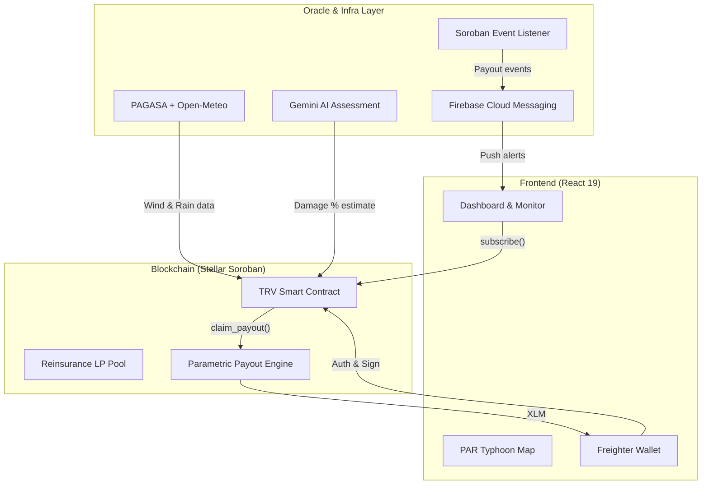

# 🌀 TyFi — Parametric Typhoon Insurance on Stellar

[](https://stellar.org)
[](https://lab.stellar.org/r/testnet/contract/CBMNXUY6U2PO56JB5TZNUNQQZFXVUJ6XOZ3T3LJZJ3U6RH64RXTP3WRN)
[](https://react.dev)
[](https://www.typescriptlang.org/)
[](https://opensource.org/licenses/MIT)

> *"Kung hagupit ang bagyo, ikaw ay babayaran."*
> — If the typhoon strikes, you will be paid.

---

## 🧩 Problem
Traditional crop insurance in the Philippines has **80%+ claim rejection rates**, takes **3–6 months** to settle, and is bureaucratically inaccessible to the 1.6 million smallholder farmers who need it most. A single typhoon can erase a season's income, leaving farmers in deep debt without immediate recourse for recovery.

## 🌟 Vision
To build the financial rails that give Filipino farmers a fighting chance against a warming world. We aim to provide global infrastructure for climate survival through fast, cheap, and accessible decentralized parametric insurance that scales across all disaster-prone regions.

## 🎯 Purpose
TyFi was built to eliminate the middleman and the waiting game in disaster recovery. By leveraging Stellar's high-speed, low-cost blockchain and Soroban smart contracts, we provide a transparent, automated insurance protocol that pays out the moment disaster strikes—not months later.

## 👥 Target Users
- **Filipino Smallholder Farmers**: RSBSA-registered rice, corn, and sugarcane farmers earning ₱150–250/day in typhoon-prone provinces.
- **DeFi Liquidity Providers (Reinsurers)**: Global yield seekers looking for real-world asset (RWA) exposure with 8.4% APY.
- **Donors & NGOs**: Climate-focused organizations (USAID, WFP) seeking transparent mechanisms to subsidize farmer premiums.

## ✨ Features
- **🚀 Parametric Payouts** — Automated payouts triggered by objective PAGASA-verified wind speed thresholds—no claim forms required. The contract uses a sliding-scale damage curve to ensure fairness.
- **🛰️ Live Typhoon Tracking** — Interactive dashboard tracking storm paths in real-time within the Philippine Area of Responsibility (PAR), featuring multi-farm proximity detection.
- **🌾 Farmer Verification** — RSBSA and land title verification gate to ensure legitimate policy registration. Farmers upload Deeds of Sale or Land Titles which are verified by admins.
- **🏦 LP Reinsurance Pool** — Yield-bearing liquidity pool (8.4% APY) lets DeFi users back agricultural risk. Premiums paid by farmers flow directly to LPs as yield.
- **⚡ Oracle Consensus Simulator** — A built-in testnet sandbox to simulate the full end-to-end oracle → consensus → disbursal pipeline for demonstration and testing.
- **📊 Parametric Analytics** — High-fidelity telemetry charts overlaying real wind/rain data against contract trigger thresholds for transparent risk assessment.
- **📱 FCM Push Notifications** — Real-time mobile alerts for farmers before, during, and after typhoon events, keeping them informed of their policy status.

## 📊 Parametric Payout Scale

The smart contract executes payouts based on objective wind speed data. This eliminates the need for manual damage assessments.

| Wind Speed | Category | Oracle Damage % | Payout |
|---|---|---|---|
| < 100 km/h | No trigger | 0% | 0 XLM |
| 100–119 km/h | Typhoon | ~30% | **30% of coverage** |
| 120–149 km/h | Severe Typhoon | ~70% | **70% of coverage** |
| ≥ 150 km/h | Super Typhoon | 100% | **Full coverage** |

## 🛠️ Tech Stack
- **Frontend**: React 19, TypeScript, Vite, Vanilla CSS, Leaflet.js
- **Backend**: Node.js (Express), Firebase (Functions, Firestore, Auth, Hosting)
- **Blockchain**: Stellar (Soroban, Rust SDK v20.5.0, XLM native asset)
- **AI/ML**: Gemini API (via Firebase Genkit) for parametric damage estimation and AI Copilot assistance.

## 🏗️ Architecture
The system consists of three main layers: the user interface, the off-chain infrastructure (oracles and listeners), and the on-chain insurance vault.



## 📖 Roadmap

### ✅ Phase 1 — Testnet (Current)
- [x] Core Soroban contract with sliding-scale parametric payouts.
- [x] Multi-oracle quorum consensus mechanism.
- [x] RSBSA + Land Title / Deed of Sale verification gate.
- [x] LP reinsurance staking portal with yield projections.
- [x] Live typhoon tracking map and parametric weather analytics.
- [x] FCM push notification infrastructure.

### 🎯 Phase 2 — Mainnet Pilot (Q3 2026)
- [ ] Mainnet deployment with authorized PAGASA oracle feeds.
- [ ] 500–1,000 farmer pilot in Albay, Leyte, and Eastern Samar.
- [ ] GCash / Maya bridge integration for off-ramping XLM to local currency.
- [ ] Department of Agriculture RSBSA data partnership.

### 🚀 Phase 3 — Scale (2027+)
- [ ] Expansion to all 18 Philippine regions and neighboring SE Asian countries.
- [ ] Climate DAO governance — community-driven adjustment of premium rates and thresholds.
- [ ] Carbon credit integration for climate-resilient farming practices.


## Prerequisites 

| Tool | Version | Install |
|---|---|---|
| Rust + Cargo | stable (≥ 1.74) | [rustup.rs](https://rustup.rs) |
| Stellar CLI | ≥ 20.x | [Stellar CLI docs](https://developers.stellar.org/docs/smart-contracts/getting-started/setup) |
| Node.js | ≥ 18.x | [nodejs.org](https://nodejs.org) |
| Freighter Wallet | latest | [freighter.app](https://freighter.app) |

## 🚀 How to Run Locally

### Smart Contract
```bash
cd contracts/typhoon_resilience_vault
stellar contract build
cargo test
```

### Frontend
```bash
cd frontend
npm install
npm run dev
```

### Backend
```bash
cd backend
npm install
npm run dev
```

## 🌐 Deployment

### Testnet
- Contract / App Address: `CBMNXUY6U2PO56JB5TZNUNQQZFXVUJ6XOZ3T3LJZJ3U6RH64RXTP3WRN` 
- 📸 Screenshot — Stellar Expert (Testnet)
  
- Link: [Stellar Expert Testnet](https://stellar.expert/explorer/testnet/contract/CBMNXUY6U2PO56JB5TZNUNQQZFXVUJ6XOZ3T3LJZJ3U6RH64RXTP3WRN)

### Mainnet
- Contract / App Address: `CAAQCLJ7SF5IP3BHD4OKPLMCDQTEVTRYWEXYBQIGNL6U6ZYIK7HNCHEK`
- 📸 Screenshot — Stellar Expert (Mainnet)
  
- Link: [Stellar Expert Mainnet](https://stellar.expert/explorer/mainnet/contract/CAAQCLJ7SF5IP3BHD4OKPLMCDQTEVTRYWEXYBQIGNL6U6ZYIK7HNCHEK)

## 🎥 Demo
- 🔗 Live App: [https://ptrv-22b15.web.app/](https://ptrv-22b15.web.app/)
- 🎬 Demo Video: [https://youtu.be/dY-zH4tBCQg](https://youtu.be/dY-zH4tBCQg)
- 🖼️ Pitch Deck: [https://canva.link/md0xjm7hr9p4rgs](https://canva.link/md0xjm7hr9p4rgs)

## 👨‍💻 Team
| Name | Role | GitHub |
|---|---|---|
| Prince Dale Limosnero | Lead Blockchain Architect / Smart Contract Engineer / Frontend Architect / Web3 Developer / Backend & Cloud Engineer / UI/UX Designer / AI Integration Specialist / Prompt Engineer / DevOps / Blockchain Operations Manager | [@PrinceDale99](https://github.com/PrinceDale99) |

## 📜 License
MIT License

Copyright (c) 2026 TyFi

Permission is hereby granted, free of charge, to any person obtaining a copy
of this software and associated documentation files (the "Software"), to deal
in the Software without restriction, including without limitation the rights
to use, copy, modify, merge, publish, distribute, sublicense, and/or sell
copies of the Software, and to permit persons to whom the Software is
furnished to do so, subject to the following conditions:

The above copyright notice and this permission notice shall be included in all
copies or substantial portions of the Software.

THE SOFTWARE IS PROVIDED "AS IS", WITHOUT WARRANTY OF ANY KIND, EXPRESS OR
IMPLIED, INCLUDING BUT NOT LIMITED TO THE WARRANTIES OF MERCHANTABILITY,
FITNESS FOR A PARTICULAR PURPOSE AND NONINFRINGEMENT. IN NO EVENT SHALL THE
AUTHORS OR COPYRIGHT HOLDERS BE LIABLE FOR ANY CLAIM, DAMAGES OR OTHER
LIABILITY, WHETHER IN AN ACTION OF CONTRACT, TORT OR OTHERWISE, ARISING FROM,
OUT OF OR IN CONNECTION WITH THE SOFTWARE OR THE USE OR OTHER DEALINGS IN THE
SOFTWARE.
