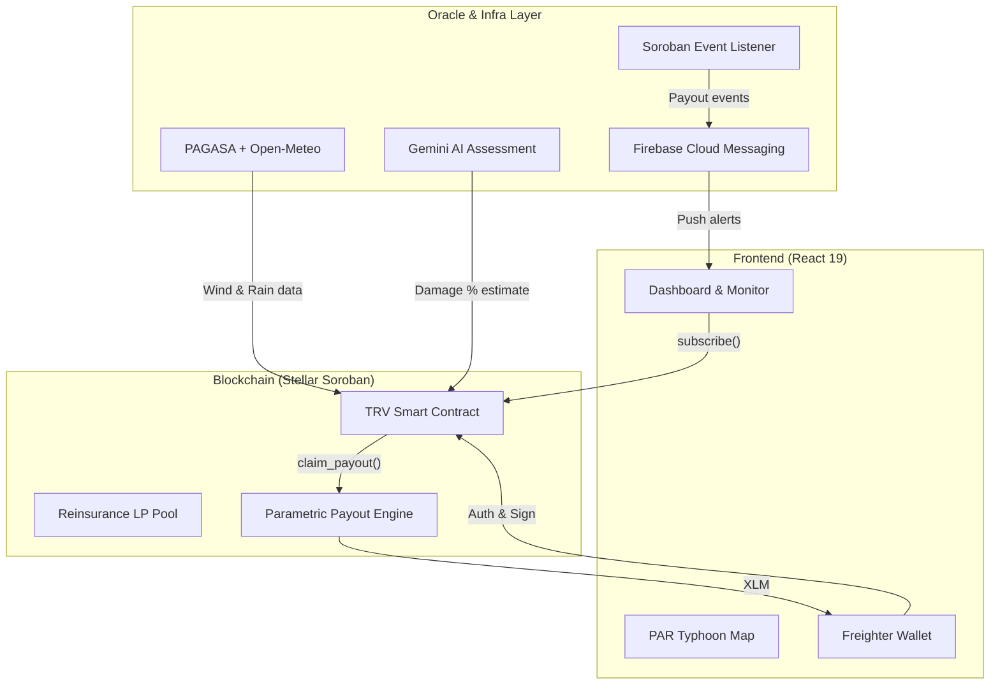
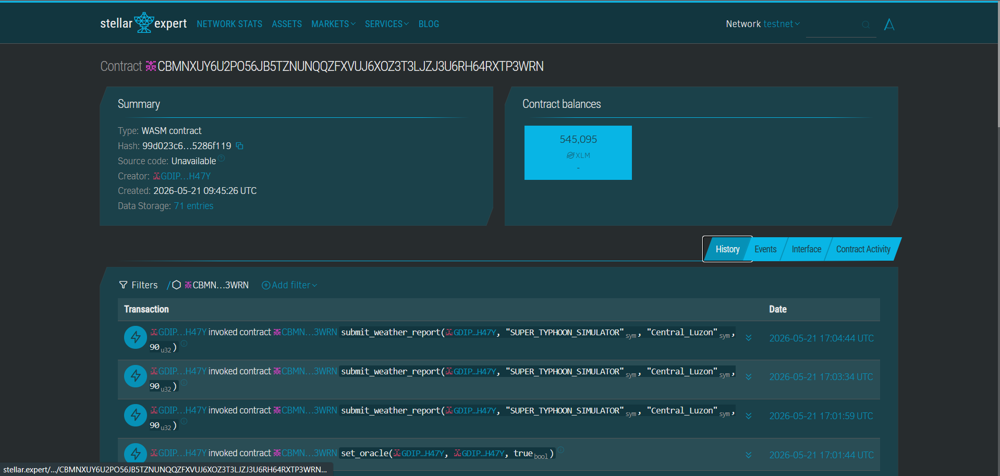

# 🌀 TyFi — Parametric Typhoon Insurance on Stellar

[](https://stellar.org)
[](https://lab.stellar.org/r/testnet/contract/CA5LYHCA4PVITUBE6TBEVMHADXEE5G2DL3QXLUNBODLDS6JUOR6IBX47)
[](https://react.dev)
[](https://www.typescriptlang.org/)
[](https://opensource.org/licenses/MIT)

> *"Kung hagupit ang bagyo, ikaw ay babayaran."*
> — If the typhoon strikes, you will be paid.

 

---

## 🧩 Problem & Solution

### The Problem
Meet **Mang Kanor**, a 56-year-old rice farmer in Albay, a province far away from the city and directly in the path of the Pacific typhoon belt. He earns just ₱200/day and plants his crops once a season. When Typhoon Odette struck, the floodwaters wiped out his entire harvest overnight. 

Mang Kanor had traditional crop insurance, but because he lives remotely, filing the claim required a 3-hour bus ride to the city. Even after submitting his paperwork, it took **4 months to process**, only to be **rejected** due to a technicality in his missing documentation. Without his harvest and with his claim denied, his family lost their entire income and was forced deep into debt just to survive the recovery period.

Traditional crop insurance in the Philippines has **80%+ claim rejection rates**, takes **3–6 months** to settle, and is bureaucratically inaccessible to the 1.6 million smallholder farmers like Mang Kanor who need it most.

### The Solution
**TyFi (Typhoon Finance)** solves this by completely eliminating the claim forms, the adjusters, and the waiting period. 

Using **TyFi**, Mang Kanor simply registers his farm once on his mobile phone and pays a micro-premium in XLM. The moment a PAGASA-verified weather oracle detects that a typhoon's wind speed has exceeded the 100 km/h threshold directly over his exact GPS coordinates in Albay, a **Stellar Soroban smart contract automatically triggers his payout**.

Within seconds of the typhoon hitting, the XLM funds are disbursed directly into Mang Kanor's Freighter wallet—meaning he has the money to buy food, rebuild his roof, and replant his seeds *the very next morning*, not 6 months later. Stellar's sub-cent fees make this micro-insurance economically viable for farmers like Mang Kanor for the very first time.

## 🎯 Purpose
TyFi was built to eliminate the middleman and the waiting game in disaster recovery. By leveraging Stellar's high-speed, low-cost blockchain and Soroban smart contracts, we provide a transparent, automated insurance protocol that pays out the moment disaster strikes—not months later.

## 👥 Target Users
- **Filipino Smallholder Farmers**: RSBSA-registered rice, corn, and sugarcane farmers earning ₱150–250/day in typhoon-prone provinces.
- **DeFi Liquidity Providers (Reinsurers)**: Global yield seekers looking for real-world asset (RWA) exposure with 8.4% APY.
- **Donors & NGOs**: Climate-focused organizations (USAID, WFP) seeking transparent mechanisms to subsidize farmer premiums.

## ✨ Features
- **🚀 Parametric Payouts** — Automated payouts triggered by objective PAGASA-verified wind speed thresholds—no claim forms required. The contract uses a sliding-scale damage curve to ensure fairness.
- **🛰️ Live Typhoon Tracking** — Interactive dashboard tracking storm paths in real-time within the Philippine Area of Responsibility (PAR), featuring multi-farm proximity detection.
- **🌾 Farmer Verification** — RSBSA and land title verification gate to ensure legitimate policy registration. Farmers upload Deeds of Sale or Land Titles which are verified by admins.
- **🏦 LP Reinsurance Pool** — Yield-bearing liquidity pool (8.4% APY) lets DeFi users back agricultural risk. Premiums paid by farmers flow directly to LPs as yield.
- **⚡ Oracle Consensus Simulator** — A built-in testnet sandbox to simulate the full end-to-end oracle → consensus → disbursal pipeline for demonstration and testing.
- **📊 Parametric Analytics** — High-fidelity telemetry charts overlaying real wind/rain data against contract trigger thresholds for transparent risk assessment.
- **📱 FCM Push Notifications** — Real-time mobile alerts for farmers before, during, and after typhoon events, keeping them informed of their policy status.

## 📊 Parametric Payout Scale

The smart contract executes payouts based on objective wind speed data. This eliminates the need for manual damage assessments.

| Wind Speed | Category | Oracle Damage % | Payout |
|---|---|---|---|
| < 100 km/h | No trigger | 0% | 0 XLM |
| 100–119 km/h | Typhoon | ~30% | **30% of coverage** |
| 120–149 km/h | Severe Typhoon | ~70% | **70% of coverage** |
| ≥ 150 km/h | Super Typhoon | 100% | **Full coverage** |

## 🛠️ Tech Stack
- **Frontend**: React 19, TypeScript, Vite, Vanilla CSS, Leaflet.js
- **Backend**: Node.js (Express), Firebase (Functions, Firestore, Auth, Hosting)
- **Blockchain**: Stellar (Soroban, Rust SDK v20.5.0, XLM native asset)
- **AI/ML**: Gemini API (via Firebase Genkit) for parametric damage estimation and AI Copilot assistance.

## 🏗️ Architecture
The system consists of three main layers: the user interface, the off-chain infrastructure (oracles and listeners), and the on-chain insurance vault.



## 📖 Roadmap

### ✅ Phase 1 — Testnet (Current)
- [x] Core Soroban contract with sliding-scale parametric payouts.
- [x] Multi-oracle quorum consensus mechanism.
- [x] RSBSA + Land Title / Deed of Sale verification gate.
- [x] LP reinsurance staking portal with yield projections.
- [x] Live typhoon tracking map and parametric weather analytics.
- [x] FCM push notification infrastructure.

### 🎯 Phase 2 — Mainnet Pilot (Q3 2026)
- [ ] Mainnet deployment with authorized PAGASA oracle feeds.
- [ ] 500–1,000 farmer pilot in Albay, Leyte, and Eastern Samar.
- [ ] GCash / Maya bridge integration for off-ramping XLM to local currency.
- [ ] Department of Agriculture RSBSA data partnership.

### 🚀 Phase 3 — Scale (2027+)
- [ ] Expansion to all 18 Philippine regions and neighboring SE Asian countries.
- [ ] Climate DAO governance — community-driven adjustment of premium rates and thresholds.
- [ ] Carbon credit integration for climate-resilient farming practices.


## Prerequisites 

| Tool | Version | Install |
|---|---|---|
| Rust + Cargo | stable (≥ 1.74) | [rustup.rs](https://rustup.rs) |
| Stellar CLI | ≥ 20.x | [Stellar CLI docs](https://developers.stellar.org/docs/smart-contracts/getting-started/setup) |
| Node.js | ≥ 18.x | [nodejs.org](https://nodejs.org) |
| Freighter Wallet | latest | [freighter.app](https://freighter.app) |

## 🚀 How to Run Locally

### Smart Contract
```bash
cd contracts/typhoon_resilience_vault
stellar contract build
cargo test
```

### Frontend
```bash
cd frontend
npm install
npm run dev
```

### Backend
```bash
cd backend
npm install
npm run dev
```

## 🌐 Deployment

### Test Net Transaction
- Contract / App Address: `CA5LYHCA4PVITUBE6TBEVMHADXEE5G2DL3QXLUNBODLDS6JUOR6IBX47` 
- 📸 Screenshot — Stellar Expert (Testnet)
  
- Link: [Stellar Expert Testnet](https://stellar.expert/explorer/testnet/contract/CA5LYHCA4PVITUBE6TBEVMHADXEE5G2DL3QXLUNBODLDS6JUOR6IBX47)

### Main Net Transaction
- Contract / App Address: `CAAQCLJ7SF5IP3BHD4OKPLMCDQTEVTRYWEXYBQIGNL6U6ZYIK7HNCHEK`
- 📸 Screenshot — Stellar Expert (Mainnet)
  
- Link: [Stellar Expert Mainnet](https://stellar.expert/explorer/mainnet/contract/CAAQCLJ7SF5IP3BHD4OKPLMCDQTEVTRYWEXYBQIGNL6U6ZYIK7HNCHEK)

## 🎥 Demo
- 🔗 Live App: [https://ptrv-22b15.web.app/](https://ptrv-22b15.web.app/)
- 🎬 Demo Video: [https://youtu.be/dY-zH4tBCQg](https://youtu.be/dY-zH4tBCQg)
- 🖼️ Pitch Deck: [https://canva.link/md0xjm7hr9p4rgs](https://canva.link/md0xjm7hr9p4rgs)

## 👨‍💻 Team
| Name | Role | GitHub |
|---|---|---|
| Prince Dale Limosnero | Lead Blockchain Architect / Smart Contract Engineer / Frontend Architect / Web3 Developer / Backend & Cloud Engineer / UI/UX Designer / AI Integration Specialist / Prompt Engineer / DevOps / Blockchain Operations Manager | [@PrinceDale99](https://github.com/PrinceDale99) |

## 📜 License
MIT License

Copyright (c) 2026 TyFi

Permission is hereby granted, free of charge, to any person obtaining a copy
of this software and associated documentation files (the "Software"), to deal
in the Software without restriction, including without limitation the rights
to use, copy, modify, merge, publish, distribute, sublicense, and/or sell
copies of the Software, and to permit persons to whom the Software is
furnished to do so, subject to the following conditions:

The above copyright notice and this permission notice shall be included in all
copies or substantial portions of the Software.

THE SOFTWARE IS PROVIDED "AS IS", WITHOUT WARRANTY OF ANY KIND, EXPRESS OR
IMPLIED, INCLUDING BUT NOT LIMITED TO THE WARRANTIES OF MERCHANTABILITY,
FITNESS FOR A PARTICULAR PURPOSE AND NONINFRINGEMENT. IN NO EVENT SHALL THE
AUTHORS OR COPYRIGHT HOLDERS BE LIABLE FOR ANY CLAIM, DAMAGES OR OTHER
LIABILITY, WHETHER IN AN ACTION OF CONTRACT, TORT OR OTHERWISE, ARISING FROM,
OUT OF OR IN CONNECTION WITH THE SOFTWARE OR THE USE OR OTHER DEALINGS IN THE
SOFTWARE.

## 📈 Monthly Growth Report
*(Growth metrics and data will be added here on a monthly basis.)*

## 🌟 Community Contribution Proof
TyFi won **Best on Stellar** at the recent Stellar x RiseIn Philippines hackathon due to its insane potential to help local farmers!


## 📱 Social Media & Updates
- **Instagram**: [https://www.instagram.com/_vertigral/](https://www.instagram.com/_vertigral/)
- **Product Updates**: [https://www.instagram.com/p/DZ_pm_xk-2B/](https://www.instagram.com/p/DZ_pm_xk-2B/)

## 🔧 Product Improvement Commits
- **Local Language Support**: [893717d](https://github.com/PrinceDale99/TyFi/commit/893717d)
- **Livestock & Asset Coverage**: [f3ee9f5](https://github.com/PrinceDale99/TyFi/commit/f3ee9f5)
- **Offline Map Caching**: [69a778f](https://github.com/PrinceDale99/TyFi/commit/69a778f)
- **SMS Claim Filing**: [ee85c42](https://github.com/PrinceDale99/TyFi/commit/ee85c42)
- **Live Weather Radar**: [8224406](https://github.com/PrinceDale99/TyFi/commit/8224406)
- **Cooperative & Shared Accounts**: [45cb144](https://github.com/PrinceDale99/TyFi/commit/45cb144)
