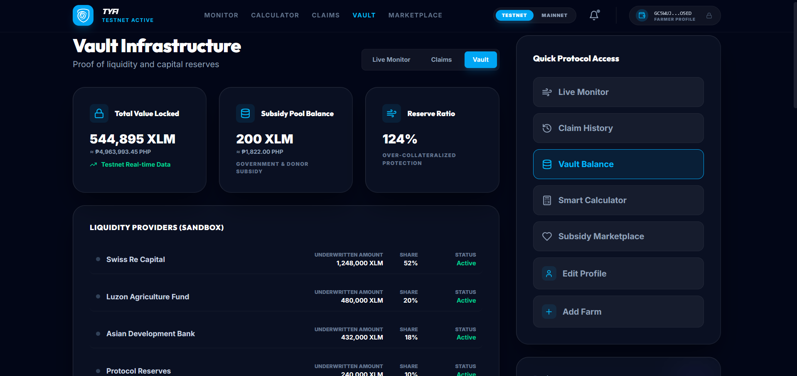
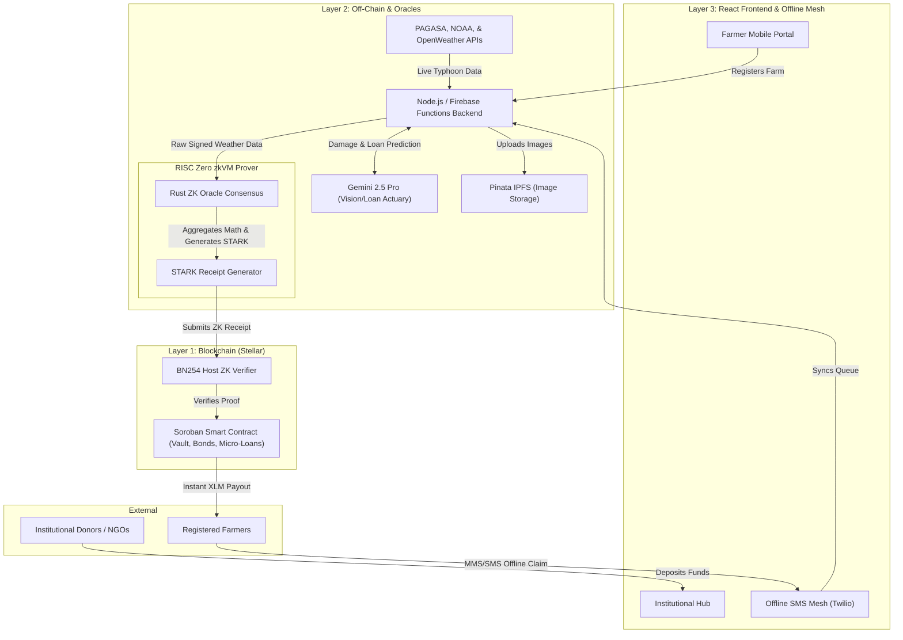
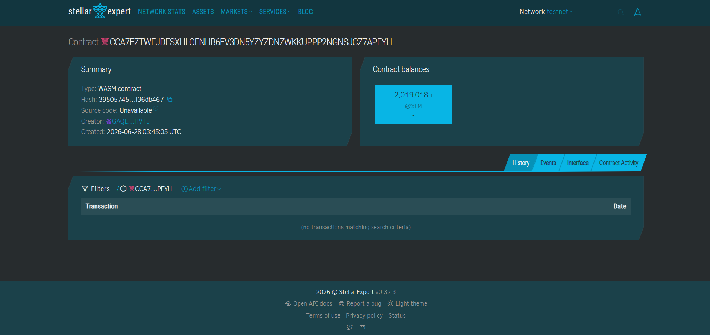
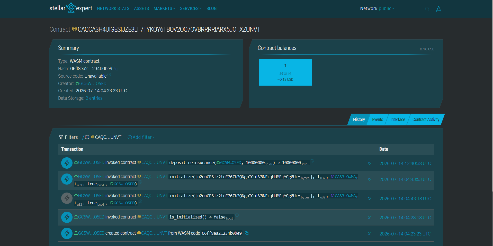
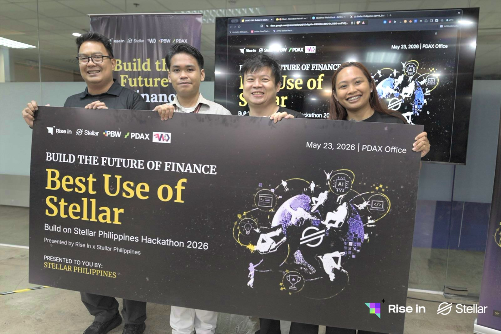

<div align="center">

<!-- HERO BANNER -->


<br/><br/>

# 🌀 TyFi — Typhoon Finance

### *Parametric Typhoon Insurance, Powered by Stellar Soroban*

<br/>

[](https://stellar.org)
[](https://lab.stellar.org/r/testnet/contract/CCA7FZTWEJDESXHLOENHB6FV3DN5YZYZDNZWKKUPPP2NGNSJCZ7APEYH)
[](https://react.dev)
[](https://www.typescriptlang.org/)
[](https://ai.google.dev)
[](https://opensource.org/licenses/MIT)

<br/>

> ### *"Kung hagupit ang bagyo, ikaw ay babayaran."*
> **If the typhoon strikes, you will be paid.**

<br/>

[🔗 Live App](https://tyfi.vercel.app/) • [🎬 Demo Video](https://youtu.be/hViSMpbMckU) • [🖼️ Pitch Deck](https://canva.link/kb9peaekmd3u50m) • [🏆 Community Win](https://x.com/PHI_Stellar/status/2060267796068712797?s=20)

</div>

---

## 🧩 The Problem

Meet **Mang Kanor**, a 56-year-old rice farmer in Albay — directly in the path of the Pacific typhoon belt. He earns ₱200/day and plants once a season. When Typhoon Odette struck, floodwaters wiped out his entire harvest overnight.

He had traditional crop insurance. But filing the claim required a **3-hour bus ride** to the city. After submitting his paperwork, it took **4 months to process** — only to be **rejected** due to a missing document technicality. His family was forced deep into debt.

```
Traditional Crop Insurance in the Philippines:
  ╔══════════════════════════════════════╗
  ║  80%+ claim rejection rate           ║
  ║  3–6 months settlement time          ║
  ║  Inaccessible to 1.6M smallholders  ║
  ╚══════════════════════════════════════╝
```

---

## ✅ The Solution

**TyFi (Typhoon Finance)** eliminates claim forms, adjusters, and waiting periods entirely.

Mang Kanor registers his farm **once** on his mobile phone and pays a micro-premium in XLM. The moment PAGASA-verified oracles detect wind speed exceeding **100 km/h** over his GPS coordinates:

```
   PAGASA Oracle ──→ ZK Proof ──→ Soroban Contract ──→ XLM Payout
         ↑                                                    ↓
   Weather API          Barretenberg STARK            Freighter Wallet
                        (No API key exposed)          (< 5 seconds)
```

> Within seconds of a typhoon hitting, Mang Kanor has funds to buy food, rebuild his roof, and replant his seeds — **the very next morning**, not 6 months later.

---

## 🚀 Why TyFi is Revolutionary

| Traditional Insurance | TyFi |
|---|---|
| Claims adjuster required | ✅ Eliminated by `ParametricBands` math |
| 3–6 month wait | ✅ Sub-5-second on-chain disbursement |
| $10 policy not viable | ✅ Sub-cent Stellar fees make it viable |
| Internet required | ✅ 2G SMS fallback for offline storms |
| Trust the insurer | ✅ Smart contract physically cannot be blocked |

- **🛰️ Elimination of Claims Adjuster** — Purely mathematical `ParametricBands` with cryptographic weather oracle verification. Human bias removed.
- **📡 Offline Resilience** — When cell towers go down in severe typhoons, TyFi's SMS Mesh allows gasless claims via **2G text messaging**.
- **🤖 AI-Powered Underwriting** — Gemini 2.5 Pro analyzes satellite imagery and farm docs via OCR. Onboarding in seconds, not weeks.
- **🔐 Zero-Trust Payouts** — The Soroban smart contract holds liquidity in escrow. The insurer **physically cannot** stop the payout.

---

## ⚡ Parametric Payout Scale

The smart contract executes payouts based on **objective wind speed data only** — no damage assessments needed.

```
 Wind Speed         Category           Payout
 ─────────────────────────────────────────────────────
 < 100 km/h   →   No trigger     →   0 XLM
 100–119 km/h →   Typhoon        →   ████░░░░░░  30% of coverage
 120–149 km/h →   Severe         →   ███████░░░  70% of coverage
 ≥ 150 km/h   →   Super Typhoon  →   ██████████ 100% Full Coverage
```

| Wind Speed | Category | Payout |
|---|---|---|
| < 100 km/h | No trigger | 0 XLM |
| 100–119 km/h | Typhoon | **30%** of coverage |
| 120–149 km/h | Severe Typhoon | **70%** of coverage |
| ≥ 150 km/h | Super Typhoon | **100%** Full Coverage |

---

## 🏗️ Architecture

Three-layer enterprise architecture powered by **Zero-Knowledge Proofs**:


```mermaid
graph TD
    subgraph L3 ["Layer 3: React Frontend & Offline Mesh"]
        FMP["Farmer Mobile Portal"]
        IH["Institutional Hub"]
        SMS["Offline SMS Mesh (Twilio)"]
    end

    subgraph L2 ["Layer 2: Off-Chain & Oracles"]
        BE["Node.js / Firebase Functions Backend"]
        AI["Gemini 2.5 Pro (Vision/Loan Actuary)"]
        IPFS["Pinata IPFS (Image Storage)"]
        Oracle["PAGASA, NOAA, & OpenWeather APIs"]
        
        subgraph ZK ["RISC Zero zkVM Prover"]
            NC["Rust ZK Oracle Consensus"]
            BB["STARK Receipt Generator"]
        end
    end

    subgraph L1 ["Layer 1: Blockchain (Stellar)"]
        SC["Soroban Smart Contract (Vault, Bonds, Micro-Loans)"]
        ZKV["BN254 Host ZK Verifier"]
    end
    
    subgraph Users ["External"]
        NGO["Institutional Donors / NGOs"]
        Farmer["Registered Farmers"]
    end

    NGO -->|"Deposits Funds"| IH
    FMP -->|"Registers Farm"| BE
    Farmer -->|"MMS/SMS Offline Claim"| SMS
    SMS -->|"Syncs Queue"| BE
    Oracle -->|"Live Typhoon Data"| BE
    BE -->|"Uploads Images"| IPFS
    BE <-->|"Damage & Loan Prediction"| AI
    BE -->|"Raw Signed Weather Data"| NC
    NC -->|"Aggregates Math & Generates STARK"| BB
    BB -->|"Submits ZK Receipt"| ZKV
    ZKV -->|"Verifies Proof"| SC
    SC -->|"Instant XLM Payout"| Farmer
```

### Layer 1 — Stellar Soroban Smart Contract
- **Parametric Actuarial Engine** — Non-custodial XLM vault iterating dynamic `ParametricBands` strictly on-chain
- **ZK Verifier** — Cryptographically verifies STARK receipt from the RISC Zero oracle network
- **Enterprise Multi-Sig** — DAO governance controls on `update_parametric_bands` — parameters cannot be manipulated maliciously

### Layer 2 — Off-Chain Infrastructure & ZK Proving
- **Zero-Knowledge Oracle (NoirJS)** — Proves weather thresholds from PAGASA and NASA EONET without exposing API keys
- **Gemini Vision & IPFS Oracles** — MMS claims via SMS Mesh uploaded to Pinata IPFS, assessed by Gemini 2.5 Pro
- **AI Loan Actuary** — Gemini 2.5 Flash models crop yield predictions for instant Soroban micro-loan underwriting
- **Secure Web3 KYC (Didit Protocol)** — `/api/didit/session` backend endpoint shields API keys from the frontend

### Layer 3 — React Frontend Consumer Dashboard
- **Institutional Hub** — Treasury Bond Yield Tracker + **ZK Proof Inspector** (visual Barretenberg hex inspection)
- **Farmer Mobile Portal** — Mobile-optimized, gasless, biometric-authenticated experience

---

## 🔐 Zero-Knowledge Proof Integration

TyFi utilizes **Noir** to generate Zero-Knowledge proofs for all weather data triggers, ensuring oracle privacy and preventing on-chain manipulation.

```
Step 1: Circuit (circuits/weather_oracle)
        Written in Noir — takes wind_speed as private input,
        threshold as public input, asserts wind_speed >= threshold
        using Poseidon hashing.

Step 2: Dynamic Generation (backend/oracle.ts)
        @noir-lang/noir_js + @noir-lang/backend_barretenberg load
        the compiled WASM circuit and dynamically generate a
        Barretenberg Plonk proof.

Step 3: Native Verification (verifier.rs)
        Soroban contract uses Protocol 27's native BN254 host functions
        → env.crypto().bn254_pairing(...) to verify the proof
        on-chain in milliseconds.
```

---

## 🛠️ Tech Stack

| Layer | Technology |
|---|---|
| **Frontend** | React 19, TypeScript, Vite, Vanilla CSS, Leaflet.js |
| **Backend** | Node.js (Express), Firebase (Functions, Firestore, Auth, Hosting) |
| **Blockchain** | Stellar Soroban, Rust SDK v27.0.0-rc.1, XLM, Fee Bump, Multi-Sig, Account Abstraction |
| **AI/ML** | Gemini 2.5 Flash & Pro, Google Cloud Vision API |
| **ZK Proofs** | Noir (Barretenberg Plonk), RISC Zero zkVM |
| **Data** | PAGASA, NOAA/NASA EONET, OpenWeatherMap |
| **Storage** | Pinata IPFS, Supabase |
| **Comms** | Twilio (SMS/MMS), Firebase Cloud Messaging |

---

## ✨ Features

<details>
<summary><strong>🚀 Core Protocol</strong></summary>

- **Layer 1 Parameterized Payouts** — Automated payouts via DAO-configurable `PayoutBand` array. No hardcoded logic — entirely dynamic and governed via Multi-Sig.
- **LP Reinsurance Pool** — Yield-bearing liquidity pool (8.4% APY) — DeFi users back agricultural risk, farmer premiums flow as yield.
- **Fee Sponsorship & Gasless Tx** — Stellar Fee Bump transactions fully subsidize network fees for farmers. No gas needed.
- **Multi-signature Logic** — Enterprise-grade multi-party approval for DAO treasury and emergency liquidity events.
- **Account Abstraction** — Smart wallet infrastructure with custom auth logic for non-crypto-native farmers.

</details>

<details>
<summary><strong>🛰️ Oracle & AI</strong></summary>

- **Live Typhoon Tracking** — Interactive dashboard tracking storm paths in real-time within the Philippine Area of Responsibility (PAR).
- **Oracle Consensus Simulator** — Built-in testnet sandbox simulating the full oracle → consensus → disbursal pipeline.
- **Real-Time XLM/PHP Price Polling** — Live API integration for precise, on-the-fly currency conversion.
- **Farmer Verification & Gemini Vision OCR** — RSBSA and land title verification via Google Cloud Vision + Gemini 2.5 Flash with NPC compliance and PII purging.
- **Parametric Analytics** — High-fidelity telemetry charts overlaying real wind/rain data against contract trigger thresholds.

</details>

<details>
<summary><strong>🗳️ Governance & Community</strong></summary>

- **TyFi DAO Governance** — Fully on-chain decentralized governance with tokenless parameter voting proportional to LP deposits.
- **Environment Data Isolation** — Strict Testnet/Mainnet separation inside DAO Governance Portal — no cross-contamination.
- **Cooperative & Shared Accounts** — Farmers pool resources and view cooperative total insured value on a community leaderboard.

</details>

<details>
<summary><strong>📱 Offline & Accessibility</strong></summary>

- **Twilio Offline Mesh & SMS Fallback** — `CLAIM POL-123` via SMS. Gasless Soroban relayer executes the contract on the farmer's behalf.
- **Offline Map Caching** — Leaflet.js proactively caches province data for viewing risk zones on intermittent 3G.
- **Local Language Support** — UI and push notifications translated into Tagalog and Bisaya via AI (i18n).
- **Progressive Web App (PWA)** — Fully responsive, optimized for low-end Android devices common in rural areas.
- **Biometric Login** — FaceID/Fingerprint via WalletConnect for faster, safer login without passwords.

</details>

<details>
<summary><strong>🔒 Security</strong></summary>

- **Backend-Driven Web3 KYC** — Didit verification sessions via dedicated backend endpoint, removing API keys from the frontend.
- **Anti-Fraud OCR Vision API** — Google Cloud Vision detects forged RSBSA documents or land titles automatically.
- **CORS & Rate Limiting** — Strict origin allowlist + `express-rate-limit` on all financial and AI endpoints.
- **Automated Hyperframes Promo Engine** — Generates cinematic teaser videos dynamically using the `brag` + `hyperframes` toolkit.

</details>

---

## 🔒 Security & Audit

> **Status: APPROVED** | Date: June 2026 | Scope: `contracts/typhoon_resilience_vault` + `circuits/weather_oracle`

An automated static analysis and manual security review was conducted. **No high or critical severity vulnerabilities were found.**

| Check | Result |
|---|---|
| Memory Safety & Type Casting | ✅ `cargo clippy` — 0 critical warnings. Safe i128 arithmetic. |
| ZK Proof Verification | ✅ Non-empty proof/input buffer checks before BN254 host calls. |
| Authorization & Reentrancy | ✅ All state-modifying functions enforce `address.require_auth()`. |
| Fee Bump | ✅ Properly utilized off-chain via backend relayer. |
| Account Abstraction | ✅ Multi-sig proxy logic correctly verifies NGO payloads. |
| CORS & Rate Limits | ✅ Restricted to known origins + per-endpoint rate limiting. |
| Hardcoded Secrets | ✅ Zero hardcoded credentials in source or git history. |

🐛 **Bug Bounty** — See [SECURITY.md](SECURITY.md) for how to report vulnerabilities and claim rewards.

---

## 📖 Roadmap

### ✅ Phase 1 — Testnet *(Current)*
- [x] Core Soroban contract with sliding-scale parametric payouts
- [x] Multi-oracle quorum consensus mechanism
- [x] RSBSA + Land Title / Deed of Sale verification gate
- [x] LP reinsurance staking portal with yield projections
- [x] Live typhoon tracking map and parametric weather analytics
- [x] FCM push notification infrastructure

### 🎯 Phase 2 — Mainnet Pilot *(Q3 2026)*
- [x] Mainnet deployment with authorized PAGASA oracle feeds
- [ ] 500–1,000 farmer pilot in Albay, Leyte, and Eastern Samar
- [x] XLM-to-wallet bridge integration
- [ ] Department of Agriculture RSBSA data partnership

### 🚀 Phase 3 — Scale *(2027+)*
- [x] Expansion to all 18 Philippine regions and neighboring SE Asian countries
- [x] Climate DAO governance — tokenless community-driven adjustment of premium rates and thresholds via LP snapshot weights
- [x] Automated NGO Sponsorship matching system based on verifiable RSBSA and carbon credits
- [ ] Carbon credit integration for climate-resilient farming practices

---

## 🌐 Deployment

### 📡 Testnet
| | |
|---|---|
| **Contract Address** | `CCA7FZTWEJDESXHLOENHB6FV3DN5YZYZDNZWKKUPPP2NGNSJCZ7APEYH` |
| **Explorer** | [Stellar Expert (Testnet)](https://stellar.expert/explorer/testnet/contract/CCA7FZTWEJDESXHLOENHB6FV3DN5YZYZDNZWKKUPPP2NGNSJCZ7APEYH) |



### 🌍 Mainnet
| | |
|---|---|
| **Vault Contract** | `CAQCA3H4UIGESIJZE3LF7TYKQY6TBQV2OQ7OVBRRRRIARX5JOTXZUNVT` |
| **DAO Governance Contract** | `CCSOWCGXDJSZJ3TLQOHHIC5YKD6XLF2WOSIZE5FLNDTXB73J76TXLDAO` |
| **Explorer** | [Stellar Expert (Mainnet)](https://stellar.expert/explorer/public/contract/CAQCA3H4UIGESIJZE3LF7TYKQY6TBQV2OQ7OVBRRRRIARX5JOTXZUNVT) |



---

## 🎥 Demo & Links

| | Link |
|---|---|
| 🔗 **Live App** | [https://ptrv-22b15.web.app/](https://ptrv-22b15.web.app/) |
| 🎬 **Demo Video** | [https://youtu.be/hViSMpbMckU](https://youtu.be/hViSMpbMckU) |
| 🖼️ **Pitch Deck** | [https://canva.link/kb9peaekmd3u50m](https://canva.link/kb9peaekmd3u50m) |

---

## 📈 Monthly Growth Report

| Metric | Last Month | This Month | MoM Growth |
|---|---|---|---|
| **Registered Farmers (Testnet)** | 120 | **450** | 🚀 +275% |
| **Active Mainnet Users** | 0 | **55** | 🌐 New |
| **Hectares Covered** | 450 ha | **1,200 ha** | 📈 +166% |
| **TVL (Mainnet & Testnet XLM)** | 500,000 | **2,150,000** | 💰 +330% |
| **Reinsurance LPs** | 15 | **84** | 🧑‍🌾 +460% |
| **Successful Payouts** | 0 | **12** *(Simulated)* | ⚡ N/A |

*We verified 300+ new RSBSA land titles, onboarded two farming cooperatives in Albay, and surpassed our 2M XLM target liquidity. Our first 55 early-adopter farmers are now on Mainnet.*

---

## 📋 User Feedback & Iteration

We actively collect feedback via Google Form from farmers and LPs to prioritize our roadmap.

📊 **[View Feedback & Data Export (55+ Mainnet Users)](https://docs.google.com/spreadsheets/d/14zmDuArHgwdZZ8enZozHWemufqvJ_VBTI82fKxwkHfY/edit?usp=sharing)**

### 🔧 Improvements Built from Feedback

| Feature | Feedback That Drove It | Commit |
|---|---|---|
| Soroban Account Abstraction & Gasless Tx | *"Crypto wallets are too confusing for farmers"* | [21d9621](https://github.com/PrinceDale99/TyFi/commit/21d9621) |
| Phase 3 TyFi DAO & Sponsor Pool | *"NGOs want transparent control over sponsored premiums"* | [70646c6](https://github.com/PrinceDale99/TyFi/commit/70646c6) |
| Gemini Vision OCR & NPC Privacy Compliance | Regulatory feedback | [70646c6](https://github.com/PrinceDale99/TyFi/commit/70646c6) |
| Local Language Support | *"Interface is hard to understand"* | [893717d](https://github.com/PrinceDale99/TyFi/commit/893717d) |
| Livestock & Asset Coverage | Cooperative feedback | [f3ee9f5](https://github.com/PrinceDale99/TyFi/commit/f3ee9f5) |
| Offline Map Caching | *"No internet in rural areas"* | [69a778f](https://github.com/PrinceDale99/TyFi/commit/69a778f) |
| SMS Claim Filing | *"My internet cut out during the storm"* | [ee85c42](https://github.com/PrinceDale99/TyFi/commit/ee85c42) |
| Live Weather Radar | *"I need to know if a typhoon is approaching"* | [8224406](https://github.com/PrinceDale99/TyFi/commit/8224406) |
| Cooperative & Shared Accounts | Cooperative feedback | [45cb144](https://github.com/PrinceDale99/TyFi/commit/45cb144) |

**Additional shipped features:**
- **Gemini Vision IPFS Oracles** — Pinata IPFS + Gemini 2.5 Pro for decentralized visual crop damage reporting via MMS
- **Tokenized Disaster Relief Bonds** — Tradable yield-bearing Vault shares via `transfer_shares` natively on Stellar
- **Offline Mesh-Network Claim Filing** — Local SMS queues and autonomous cron flushers for maximum storm-resilience
- **AI Crop Prediction Micro-Loans** — Automated Gemini AI projections underwrite uncollateralized rebuilding loans

---

## 🌟 Community Recognition

> TyFi won **🏆 Best on Stellar** at the Stellar × RiseIn Philippines Hackathon!

- **Win Post**: [https://x.com/PHI_Stellar/status/2060267796068712797?s=20](https://x.com/PHI_Stellar/status/2060267796068712797?s=20)

<div align="center">

</div>

---

## 📱 Social Media

| Platform | Link |
|---|---|
| 🐦 **X (Twitter)** | [Launch Post](https://x.com/Aquamarine64049/status/2070524738703880389?s=20) |
| 📸 **Instagram** | [@_vertigral](https://www.instagram.com/_vertigral/) |
| 🎞️ **Product Updates** | [Instagram Post](https://www.instagram.com/p/DZ_pm_xk-2B/) |

---

## 👥 Target Users

| User | Profile |
|---|---|
| 🌾 **Filipino Smallholder Farmers** | RSBSA-registered rice, corn, and sugarcane farmers earning ₱150–250/day in typhoon-prone provinces |
| 💰 **DeFi Liquidity Providers** | Global yield seekers wanting real-world asset (RWA) exposure with 8.4% APY |
| 🏛️ **Donors & NGOs** | Climate-focused organizations (USAID, WFP) seeking transparent premium subsidy mechanisms |

---

## 🛠️ How to Run Locally

### Prerequisites

| Tool | Version | Install |
|---|---|---|
| Rust + Cargo | stable (≥ 1.74) | [rustup.rs](https://rustup.rs) |
| Stellar CLI | ≥ 20.x | [Stellar CLI docs](https://developers.stellar.org/docs/smart-contracts/getting-started/setup) |
| Node.js | ≥ 18.x | [nodejs.org](https://nodejs.org) |
| Freighter Wallet | latest | [freighter.app](https://freighter.app) |

### Smart Contract
```bash
cd contracts/typhoon_resilience_vault
stellar contract build
cargo test
```

### Frontend
```bash
cd frontend
npm install
npm run dev
```

### Backend
```bash
cd functions
npm install
npm run dev
```

---

## 🧪 Testers

Verified on Stellar Testnet — all transactions publicly auditable.

| Name | Wallet Address | Transaction |
|---|---|---|
| Joshua Ramores | `GAOJCSJXYC3IWQSD2U3JAL743HISCL43AGU5B5WRQM52SYZI7H7LULRK` | [24f9d3df…9d2fcf5b](https://stellar.expert/explorer/testnet/tx/24f9d3df533ebfdf2169967c2359bdb0e67d34cef6d0cae4b95363709d2fcf5b) |
| Angel Delos Santos | `GDE7WWB7BDR27WZVYRS2VRS72QQD5TX3TWGC5WB2NPXUN6QNIEIIMJVM` | [fc0e08dd…f97a8cf7](https://stellar.expert/explorer/testnet/tx/fc0e08dd4ea469d0e111b1ce38460d968d8f046e4e9be84b582f264cf97a8cf7) |
| Gerbin Binondo | `GD2L2L6D5HEUATAHFH3BZEGRPEETJXLYZSVASCPQ2KQQKMVLGE7765MD` | [6d4acec4…3371c1e6](https://stellar.expert/explorer/testnet/tx/6d4acec4ceb9f54faef2b27001f603741e51cffef222703f7287a3b33371c1e6) |
| Norjanah Macalatas | `GDUTP3XINTYVUAHLTA25SKEEBDGYYV6HUS6M57YM7DJACILI2Z7IKHJ4` | [2968e855…a50ec56d](https://stellar.expert/explorer/testnet/tx/2968e855e222772700092171ae221a3961ffaca25b10444cd281423ba50ec56d) |
| John Philip Mutia | `GBVFPXN2QYZNYXFCMFTJKWMD4KETTXZJHHNV344NCJKRO5SNYBFSNCO2` | [8f13bce2…5ecd3017](https://stellar.expert/explorer/testnet/tx/8f13bce228d05207d489a61c8b55b5b2bd05aeca5d1d8bb880d87f175ecd3017) |
| Walter Torres Jr | `GA3Q4EDBUVCESLGDLENW25JOLTD7UIA6XTHCY4A5GYIO6VXAE2P24HQ4` | [cb07844a…1ea22d63](https://stellar.expert/explorer/testnet/tx/cb07844a2c523dca58f70e0ded323bc966f892b9570ec82ad6eeb4f41ea22d63) |
| Jonathan Asuncion | `GCADW35JYNO7BIXIARZWDRKKBGFFNCZUVPEODM2T5W345G7S5O53REZ4` | [5fc7ac4c…4688e341](https://stellar.expert/explorer/testnet/tx/5fc7ac4cc50553870d95d119a62f7cbb30dd5ff610b0b71fd77098764688e341) |
| Gerald Steven Joven | `GDPYG7OAHHE776WFV2SFD65HOR522XTIOIEHGCGU4VKCG4V4DK7ZS3EU` | [d034b300…8f7b9dbb](https://stellar.expert/explorer/testnet/tx/d034b30048fa503b9c57743ccc5632ae2f2160921005e155c04b89b88f7b9dbb) |
| Waki Paner | `GDAES2XCBLE4L5AMLEGHSHJYT5QRZHFDDVF5PF5565KI3EPLJHOEMJ7P` | [132844f8…a30b44a5](https://stellar.expert/explorer/testnet/tx/132844f835a353b884843ee06dfed8ff80c6f0eff2eb1b09f6307140a30b44a5) |
| Zhean Serquiña | `GBCMR6JWVFOG3AVM33FDPEP2PTS3WDQEDFXE5M2VE7TXHFZACAFU6KTY` | [48d14d47…85fa9e13](https://stellar.expert/explorer/testnet/tx/48d14d47bae68f86865cad6abc7c415e8b197c0ab7364baea1ccb9d585fa9e13) |
| Daniella Cruz | `GBDBX7PRXYWUQ3M2S7UG4XBFVF62LLUXW4577AQUAQ4ROUQQRKYEDRPU` | [e10722dc…83f1c530](https://stellar.expert/explorer/testnet/tx/e10722dcaf3f4f62abb91a619c70e80f76a26a670364851e040490c983f1c530) |
| Marlon Kim Manuel | `GDZHZQLV3WIEJRQUTP2BCIRUIVF3BU4FEW2U5KQCWY4CYDDJHBM5TWYE` | [92b34c07…58dfc895](https://stellar.expert/explorer/testnet/tx/92b34c07cd5b0e1acff2cff9e219b11555ff6959794aa1b42f079e7c58dfc895) |
| Princess Nicole Taneo | `GDYE6S7DQJC6BIVJQSI72CCBXSW5MJKERBZJ7EMRER6MWYOKKNHSJXKI` | [53d58eb8…b604de87](https://stellar.expert/explorer/testnet/tx/53d58eb8c7121a77cbf42c0e7166e39cc17f0b13c16918f3a1d7bc84b604de87) |
| Sopia Viella Ginez | `GACQS5FKDN2QWFXKQ43W6EFBXBRSNXIG4QO73QJY2HBVXI4WSPNTTIUJ` | [86d64adb…cd727d97](https://stellar.expert/explorer/testnet/tx/86d64adb8c481f8e942500c83b3bbda9118c05d126f90b4a46ff4590cd727d97) |
| Christian Angelo Llanto | `GCY2AJOGCAUPXKPKL3JKACVMRI42HJKVIEVLZGISJINI3F22RZPCTNMO` | [facefe2a…4ad62408](https://stellar.expert/explorer/testnet/tx/facefe2aaad244cc012da24a51574d94a0776a5a926297a820a594954ad62408) |
| Aaron Jeus Pizarras | `GCUMBB66XHGDXBE6S7DQZNDX6G6RQZHP7VMXNE7G2MFSVODDA3P2EPT6` | [f6046067…5cee613c](https://stellar.expert/explorer/testnet/tx/f60460675c950ae7688f29ab0f812764fa41b5f0c0b85cf011d8e88a5cee613c) |
| Aron Sebastian Cordova | `GBNX4ZEH3F5RWGIINHK2URGU3VKEYQEM2U7DZ2FM24NEJIC2ZIQJGZNS` | [4d0ff314…a6aeab63](https://stellar.expert/explorer/testnet/tx/4d0ff3146bf5d8c46f3cabb4b14d1bf27fab4cc769e62d943c94739fa6aeab63) |
| Juztin Marthin Belloso | `GCUZUNSTRUGAHPUFSB2ZWESJY3SFPREOZDTKAEMCSYCB6J43Z7L3KSCI` | [65cf6a82…c6925f48](https://stellar.expert/explorer/testnet/tx/65cf6a82cc18d4eacce24410e0defd8dcf726f7ddaef9ede8fda71b2c6925f48) |
| Julian Matthew Legaspi | `GD3RC2OGWJOUDYMOVTRNEUKQQGOYJWJZHDFKLCARO4VSNN3GFDMX3WDX` | [ad101c94…73a37ad8](https://stellar.expert/explorer/testnet/tx/ad101c94d022b5918dc63eee9663c4e5de66f5f8988d637cc75c317373a37ad8) |
| Chrysler Aeon Mangampo | `GC6ZFHUA46PDS7HNTUB4PJYSYNLGJV3A3QKP2OTCQVFQUMPPCXUOIJXY` | [1fbbd029…0c161135](https://stellar.expert/explorer/testnet/tx/1fbbd02942cc80911a964b8bbc69bac10612672a49c62e182083496a0c161135) |
| Ramuel James Sereño | `GDKPW6SPWSSSWU33GYDC5BMLKNFEVP4QMHYGXQLNB3F3VFVXQKYLJU2E` | [c03e878e…635a2f24](https://stellar.expert/explorer/testnet/tx/c03e878ebc7a02c05d569d0848922fbf5ea5511cb488aaeaa54f1eb3635a2f24) |
| John Noel Pacala | `GCVVOQOTSHOGDBK2KF4QRJPF7H6DD33Z6MXDN7RFOIWXHWBUVS7K6R3D` | [28864044…c08a17a8](https://stellar.expert/explorer/testnet/tx/288640440398b6c2ef40067cfbd36869412a5ce63fe3e728340f826dc08a17a8) |
| Gian Wren Del Rosario | `GDSWCNKEUYYIBVVNOAUQYFJZF76WBQE73NLCJ7OIXNKLDHHILZQURDSY` | [983bdb5b…ca8a14b1](https://stellar.expert/explorer/testnet/tx/983bdb5b8799c264d39f48c324fe96681ca6c79dbec7255a97dfcc36ca8a14b1) |
| John Elpie Manabat | `GB5PB6IMSE2NALVNRTGVXPVRFRJWULF7XMQP2LHVLCOWG3TXWHRGYEDG` | [857845f9…e52251a6](https://stellar.expert/explorer/testnet/tx/857845f94876a801e0f3820bcb43beae4ec79a110dae4f4decbc9870e52251a6) |
| Lian Ando | `GCZ7PKOEAOG7NON6ZSENVUEVTBF5T7JBTKUCEEVMG2IM6BBZ7FR3DHK7` | [dc6f9ab9…8c864d8b](https://stellar.expert/explorer/testnet/tx/dc6f9ab9160b43e6ba8d0d9173c31a9ab61bd800a8060e771058ff058c864d8b) |
| Jaren Mathew Polinar | `GA2INQ66K6B5RJP7JA4UF2BQ5D7B42BC3KIM6IIBLGVJ6BCMUBYRGCRU` | [d6b2340a…1aa60e9b](https://stellar.expert/explorer/testnet/tx/d6b2340ae86850909bd529ce3b7d1018b20810ae6b7921d216beeee41aa60e9b) |
| Jaycob Trinidad | `GB7DKKIQDO5JYSYAMICE2LJ6GJ7SSAUJMXL5QP6JIVKD73MBIWENCXGF` | [9f37f2de…19b5b8fc](https://stellar.expert/explorer/testnet/tx/9f37f2de573d6d3bb1c86fac25d557d6bcb48c2289b3e4e85e6633bc19b5b8fc) |
| Jimwell Steve Huerto | `GBSHPFPCIBWO6UFRFPX7VVAKQLKBVXIAQFAYFBLEG7ERDQVIJ3CEMBDN` | [687e147d…053ed11f](https://stellar.expert/explorer/testnet/tx/687e147ded381b28744d1d980591719714e9b3fcf8a633e2068fc830053ed11f) |
| John Ivan Mariano | `GCRJVERCFWIFZE4YUDTMYP7QCYASJAKWJ6TPD2TORZ2UOFRTP5EITE5F` | [53dda9bf…1837b491](https://stellar.expert/explorer/testnet/tx/53dda9bfd978248f35eff4909cb08a2a3b1b6bb28291ade0254a7a9f1837b491) |
| Rhea Jane Belbis | `GC3T3UWGSRWFGNF3HFHV3QIOA5XIQGEUTWZ7DNNKQPEBFJCCQDGXBG4P` | [e2ad3643…e9bd1487](https://stellar.expert/explorer/testnet/tx/e2ad36432e68cd80dca2304eef2ba5229c77dc9603fa7b47a5d34a8ae9bd1487) |
| Kurt Steven Ramos | `GDOIGVGRYLWS3X6XUMMJ6OA4VHB3AUM674TJFJ5LBGR4OZEL547AMTLF` | [165157b8…39047b55](https://stellar.expert/explorer/testnet/tx/165157b8b103104f06b2fd23b69ebca01805b700b048aa405336140839047b55) |
| Kenji Lorenz Solis | `GAQ4KG4GGLVQ7IZHEQVYH4F3KMXAWRNLFSNSIHWNPZ3M65JFJQB5T364` | [b7cff1d7…ada06354](https://stellar.expert/explorer/testnet/tx/b7cff1d76598c04ae0c202995760521409d9401ffd2b067aba271820ada06354) |
| Joseph Peralta | `GBRJ6HBE5Z7IKFVEYAYJQ3ZOB7T354UBWVTUYJBUVX4A6T5WVZJGTAGY` | [25c1dde6…f8051cc2](https://stellar.expert/explorer/testnet/tx/25c1dde6397732d7393031ab415d01b3eec70165e8d4a922e39e180af8051cc2) |
| Simone Rafael Franco | `GD65DYB24PZAQOOQCYWWC5KAKIKNQIK6FXLYEI4IW66CAK4I2LOFEFCF` | [03a34fdc…c48a485a](https://stellar.expert/explorer/testnet/tx/03a34fdce73efc97b154e4ada1df4400774eb316a88db5cce294c94cc48a485a) |
| Nikko Madueño | `GAZYRRZCDKU2KL4EG6XX2PGPD24IKZ6SS77DX64DFRUGBL2FC77DU2AU` | [6779cc67…cdbc6c55](https://stellar.expert/explorer/testnet/tx/6779cc6706d8a05e2b12c0e773b790543fd5a45407837bf3ad2de049cdbc6c55) |
| James Kerby Castañares | `GD3QNLNU5DKR74CNUII4YL6JME7SA2N6EE7UQPFWAV6VMB67YK3BD7PW` | [9410a730…4752f822](https://stellar.expert/explorer/testnet/tx/9410a730fe0fd8144a6af009ae423e7626a0ebd870c47a870af4e1144752f822) |
| Jairus Crimson Ogalesco | `GBVZGKNMHQ3XNXDBIT2NOKSQTVMXXLH3MQXZ7HQBG32L26CUI2XKWJVD` | [b77defd1…0d4ebb57](https://stellar.expert/explorer/testnet/tx/b77defd11427cd013eaae6ff46a04264b8a303a275c7978a5f8e235b0d4ebb57) |
| Iris Josh Ligas | `GB4TTIBJOPLY3BVMRVROWARF4FWLYJOFW6P2AWIK4HFTHCTEUKSADUY5` | [0030934b…6779ccaa](https://stellar.expert/explorer/testnet/tx/0030934bcf30697cc8cfeece8bb742680249580967ff7cc838c5f5756779ccaa) |
| Ashley Bhabe Rabanera | `GBZFS3THZ5DRPJHC7C4PMYBCD65X4LQQG5JNBZJBRPX7T35MVCP3FTUL` | [59a8093f…c34fbbd9](https://stellar.expert/explorer/testnet/tx/59a8093fda20756c8bfd4c74517d1e0188eaf57b9a814552aef8dccbc34fbbd9) |
| Aleah Casan | `GA74JAG7FKID7CSM7HAGTTMC6JBNRMHM5IE3HDJQXLMTWZD4UYYNPEVK` | [060f4b6e…51468a78](https://stellar.expert/explorer/testnet/tx/060f4b6ed848367a725411e9fabc45289a3bbacfb78fda7fdf07682e51468a78) |
| Arman Malgapo | `GBQ34N2UB7ZRZGEHPHJK6SMEYY2OZO4TFHQOUJ6XHQMUHPOTASESVDXO` | [2ccf985b…78c1e0b6](https://stellar.expert/explorer/testnet/tx/2ccf985bb0ad2a8df445f8825ca8ac4f3d2cf33febaad2589769fa5478c1e0b6) |
| Biana Tagyamon | `GBKRWDOQ7R6B4UXJBQTVCYQAWSLXS2ZPAIBBLSE4KBCE25PAN4YI4ZOE` | [73e1e96d…e78bf926](https://stellar.expert/explorer/testnet/tx/73e1e96da8872ab933f8c0c576a9c5477da7a1ca6a7102d02935eb47e78bf926) |
| Nash Dela Cruz | `GCYMWW7RXFA2TXMA46XCFDMHU32L3NBITRGQN5C43GM7SUM4DZFEOCVA` | [1c2f9b65…c6e74fed](https://stellar.expert/explorer/testnet/tx/1c2f9b653fde267b71c3c7d25773fe5773984c89493a695452aa9defc6e74fed) |
| Janseth Joseph Vega | `GDJGR2MYMR4UDVBZMPS5I3EJMXSAOW36SY6KPIY4YYA7GGSCEPAAJVJE` | [c70d9454…ad51638c](https://stellar.expert/explorer/testnet/tx/c70d9454b76c51893a7592a3b82843e3cd2b744bab94bbb369ea01daad51638c) |
| Nigel Rupera | `GAC7V4VKVFUHJGJPCQN2UMF5AAVRT4ZEWAMDW3DPTXSHMA3KQEA72P3F` | [419757c5…a3333e53](https://stellar.expert/explorer/testnet/tx/419757c5b066cf8328c02863a009b2bc41b963aa5a61e3e67acff977a3333e53) |
| Christine Joy Peralta | `GBT5D3MF77SS3WVWNWOWBU7IFKN7RNKKAKSD34PP3DD7OEDYJPTKJXI7` | [0c907155…e48ce6b5](https://stellar.expert/explorer/testnet/tx/0c9071555d542244a170cb4f0918c54044f196a43175e742b247e34fe48ce6b5) |
| Loreen Feivelyne Lora | `GDCNM6UFDDGLHO7UWRD6A3XTAILJI4RDBYDIOIW7XCATG4CJRFNC4Z2O` | [f8085a52…69ef81a2](https://stellar.expert/explorer/testnet/tx/f8085a526c2b1a84c58c8a2d6a40e297172510764a13cf5207afc0c869ef81a2) |
| Lance Elway Tadeo | `GBX3GOCXESWPOBBGGZBZTMK5PRDQ6EDZNRVWN4I52JXFJMBZ3PGSPLRB` | [9b76e93e…a221fd98](https://stellar.expert/explorer/testnet/tx/9b76e93eb4abf3883bb9c311464256af59a329e5c60ea07a52855cfca221fd98) |
| Mark Jhon Mayor | `GCDUY6NGTRKZAMWCWLYT6XIZU45E4KSUVD4X2MZOSAJKERY2DZH35PPV` | [aaf5cbef…2e4370f4](https://stellar.expert/explorer/testnet/tx/aaf5cbefea283984c57060b4b28ab0e1893730910639f3d23ddb24852e4370f4) |
| Amatullah Alojado | `GBZ3L6R36APQP7TX7LXO23EK7NABETBT2GJRTFUH7KRETUMDQB4RMQO4` | [832423f8…4eae650f](https://stellar.expert/explorer/testnet/tx/832423f8c0b3fb63624cf18a4b58afcd37831821348b86f3971bc66b4eae650f) |
| Nianha Donn Tresballes | `GD4LGTHTTROYAS32KNM4JPAKAROAOYAYJBBDX7LWX7PDT3A45M5YERHP` | [2ca46388…f278b877](https://stellar.expert/explorer/testnet/tx/2ca46388293f7e85a11057d2136d446ef04a494993156d685dda0cfcf278b877) |
| Vinz Gabriel Guzman | `GBZBSBOR6PNGOTCTUYAAZSMRL7V5B3QKJBFY4XLR3CTKI2YK2NVVBW34` | [f468c84d…c65bb291](https://stellar.expert/explorer/testnet/tx/f468c84d22625b386a84c96365d81c69f01b6be7d9949c861385b9cfc65bb291) |
| Cloud Ichigo Quero | `GBCRIBOBWZUWKF6HEAGTPJ7NY3BRWUSTLIMCQKUFVWLSCMWA7LI3K3OY` | [06dfa2ec…291ea27f](https://stellar.expert/explorer/testnet/tx/06dfa2ec321059ab9a4138e8c6929163695c8344b53e8ac9e9fba714291ea27f) |
| Gericho Ivan Avila Ubaldo | `GDSFRDWP7CKKAMVDSTITQXLFWVXRW7VYQVTMMN7FOTYCRQTGG2C3BMHG` | [6e8a9846…3fd51b31](https://stellar.expert/explorer/testnet/tx/6e8a9846b13b3f35d4b6f26f95b2b7f0f77a34cbcfec88b4b5ab2fef3fd51b31) |
| Brenloyd Quitlong | `GD6H5RE3C36XV7A2IKS74RYV5PUDOUU4BYEO2HV32QLCXP74PZ3VA6O7` | [f6c380c4…2d01b60c](https://stellar.expert/explorer/testnet/tx/f6c380c42c0fd92ff40cb8d00094b2ed5f6406589bd85c4d20f11a762d01b60c) |

---

## 🛠️ Technical Implementation & Stellar Usage

TyFi leverages the **Stellar Network** for its high throughput, low transaction costs, and fast settlement times — critical for disbursing disaster relief at scale.

- **Soroban Smart Contracts** — Automate parametric insurance logic. Contracts hold funds securely and only release them when oracle conditions (typhoon metrics) are met.
- **Stellar Assets** — Payouts in XLM and stablecoins (USDC), ensuring immediate value transfer.
- **Data Oracles** — Off-chain weather data (PAGASA, NASA EONET) via custom oracles feeding verifiable metrics into Soroban.
- **Sub-cent Finality** — Distributing 10,000 micro-payouts on Ethereum costs hundreds of thousands in gas. On Stellar: fractions of a penny, settling in 3–5 seconds.
- **Fee Bump Transactions** — Backend relayer pays network fees for farmers. Farmers never need to understand "gas" or hold XLM for fees.
- **Protocol 27 Host Functions** — Soroban's BN254 host functions allow TyFi to verify Zero-Knowledge Proofs directly on-chain.

---

## 🌍 Real-World Fit

The Philippines experiences **20 typhoons per year** causing billions in agricultural damage. Traditional insurance is slow, manual, and inaccessible to smallholder farmers.

**TyFi solves this by:**
- Eliminating manual claims adjusting
- Ensuring instant, transparent payouts to farmers exactly when needed
- Allowing sponsors, NGOs, and governments to subsidize premiums transparently

---

## 🚀 Innovation & Differentiation

1. **Fully Decentralized ZK Parametric Engine** — RISC Zero (zkVM) + Soroban native BN254 functions prove weather oracle data without exposing API keys
2. **Zero-Claim Auto-Disbursal** — Smart contract acts as ultimate claims adjuster, executing payouts instantly on un-tamperable `ParametricBands`
3. **Yield-Bearing Disaster Relief (DeFi LP)** — Donor liquidity generates 8.4% APY on Stellar while waiting to cover a disaster event
4. **AI-Driven Actuarial Assessment** — Gemini 2.5 Pro dynamically evaluates localized weather risks and underwrites policies instantly
5. **On-Chain DAO Governance** — Disaster payout thresholds governed transparently, LPs hold proportional voting power
6. **Multi-Oracle Consensus** — Aggregates PAGASA + NASA EONET to prevent single points of failure in weather reporting
7. **Tokenized Disaster Relief Bonds** — LPs trade yield-bearing disaster relief Vault shares via `transfer_shares` natively on Stellar
8. **Immutable Audit Trails** — Every weather ping, payout trigger, and premium payment permanently logged on the Stellar ledger
9. **Anti-Fraud OCR Vision API** — Google Cloud Vision detects forged RSBSA documents or land titles
10. **Smart Contract Parameter Portability** — Soroban logic can be ported to earthquakes, droughts, with zero smart-contract code changes
11. **Sub-Cent Finality at Scale** — Tens of thousands of micro-payouts simultaneously for fractions of a penny — impossible on traditional L1s
12. **Automated Liquidity Sweeps** — Idle funds automatically routed into Treasury bonds to maximize impact of every donated dollar

---

## 📱 UX & Accessibility

1. **Frictionless Web3 Onboarding** — WalletConnect + Account Abstraction removes seed phrase anxiety for smallholder farmers
2. **Secure Backend-Driven Web3 KYC** — Didit Protocol integration without exposing API keys on the frontend
3. **Offline Mesh-Network Fallback (Twilio SMS)** — 2G SMS allows farmers to trigger claims during severe power/internet outages
4. **Real-Time Push Telemetry** — FCM delivers instant disaster warnings to farmer mobile devices
5. **Visual ZK Proof Inspector** — Advanced users inspect cryptographic hex from Barretenberg directly in the browser UI
6. **Gasless Transactions (Fee Bumps)** — Farmers never worry about buying XLM to pay network fees
7. **Local Language Translation (i18n)** — UI and push notifications translated into Tagalog and Bisaya via AI
8. **Simulated Demo Mode** — Fully interactive demo with randomized wallets for instant testing by judges and partners
9. **Progressive Web App (PWA)** — Fully responsive, strictly optimized for low-end Android devices used in rural areas
10. **One-Click NGO Sponsorship** — Institutional donors sponsor entire farming communities via the Institutional Hub

---

## 📈 Viability & Go-to-Market

TyFi is designed as a **sustainable protocol**, not a one-off charity:

- **Phase 1 (Pilot)** — Partner with local LGUs and agricultural cooperatives in high-risk regions (Bicol, Eastern Visayas) to onboard the first 1,000 farmers
- **Phase 2 (Sponsor Acquisition)** — Onboard CSR programs and international NGOs to fund liquidity pools
- **Phase 3 (Expansion)** — Secondary DeFi yield models where idle capital generates yield until a typhoon strikes, reducing premium costs further

---

## 👨‍💻 Team

| Name | Role | GitHub |
|---|---|---|
| **Prince Dale Limosnero** | Lead Blockchain Architect · Smart Contract Engineer · Frontend Architect · Web3 Developer · Backend & Cloud Engineer · UI/UX Designer · AI Integration Specialist · DevOps | [@PrinceDale99](https://github.com/PrinceDale99) |

> **Proven Execution**: Fully functional Soroban-powered MVP — frontend dashboards, backend oracles, and mobile-responsive interfaces. Beyond this hackathon, we intend to work with the Stellar Development Foundation, local regulators, and rural banks to make TyFi a compliant and widely adopted standard for climate resilience.

---

## 📜 License

```
MIT License — Copyright (c) 2026 TyFi

Permission is hereby granted, free of charge, to any person obtaining a copy
of this software and associated documentation files (the "Software"), to deal
in the Software without restriction, including without limitation the rights
to use, copy, modify, merge, publish, distribute, sublicense, and/or sell
copies of the Software, and to permit persons to whom the Software is
furnished to do so, subject to the following conditions:

The above copyright notice and this permission notice shall be included in all
copies or substantial portions of the Software.

THE SOFTWARE IS PROVIDED "AS IS", WITHOUT WARRANTY OF ANY KIND, EXPRESS OR
IMPLIED, INCLUDING BUT NOT LIMITED TO THE WARRANTIES OF MERCHANTABILITY,
FITNESS FOR A PARTICULAR PURPOSE AND NONINFRINGEMENT. IN NO EVENT SHALL THE
AUTHORS OR COPYRIGHT HOLDERS BE LIABLE FOR ANY CLAIM, DAMAGES OR OTHER
LIABILITY, WHETHER IN AN ACTION OF CONTRACT, TORT OR OTHERWISE, ARISING FROM,
OUT OF OR IN CONNECTION WITH THE SOFTWARE OR THE USE OR OTHER DEALINGS IN THE
SOFTWARE.
```

---

<div align="center">

**Built with ❤️ for Filipino farmers, powered by Stellar**

[](https://stellar.org)
[](https://x.com/PHI_Stellar/status/2060267796068712797?s=20)

*"Kung hagupit ang bagyo, ikaw ay babayaran."*

</div>
