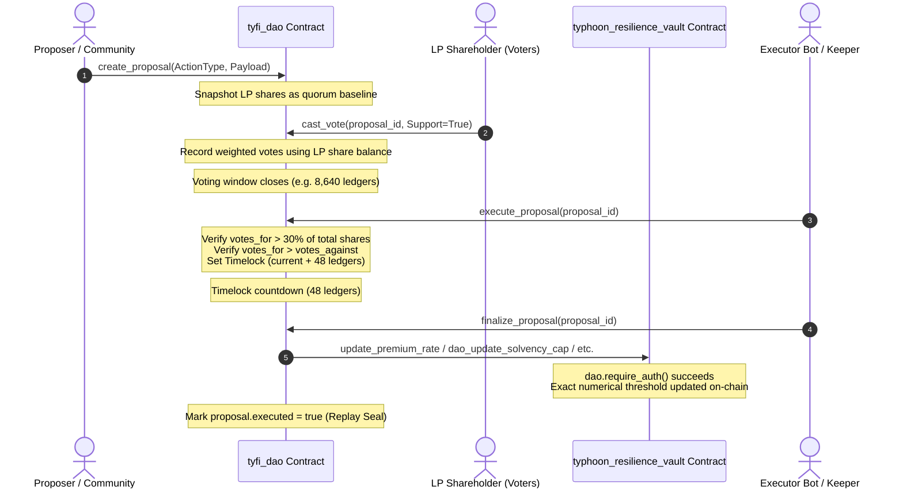

# TyFi Protocol — Week 2 Delivery Evidence

> **Expected Output:** *"Finalize and Deploy tyfi_dao: Complete the Rust code for the voting and proposal execution state machine and deploy the contract to the Stellar Testnet. Build the Invocation Bridge: Write the cross-contract functions that enable tyfi_dao to autonomously call typhoon_resilience_vault.update_params() when a proposal passes. Implement RBAC: Enforce strict Role-Based Access Control to ensure only mathematically approved DAO votes can mutate the restricted vault parameters. Execution Testing: Conduct extensive Testnet dry-runs to verify that passed proposals accurately trigger exact numerical threshold changes on the resilience pool."*
>
> **Network:** Stellar Testnet — `Test SDF Network ; September 2015`  
> **Protocol:** Soroban SDK `27.0.0-rc.1` / Protocol 29  
> **Delivery Date:** 2026-10-07  

---

## 1. 🚀 Contract Deployments — Verified On Testnet

### A. Governance Contract (`tyfi_dao`)

| Parameter | On-Chain Value |
|---|---|
| **Contract ID** | [`CB3A3IZMHF7EUM75CP5FFA6XZNABLRZAT5JL6XC4SZX3FWGRVMQM6KPY`](https://stellar.expert/explorer/testnet/contract/CB3A3IZMHF7EUM75CP5FFA6XZNABLRZAT5JL6XC4SZX3FWGRVMQM6KPY) |
| **WASM Hash** | `6bd8d130a727190d75e88dfa4b1def297a3278d898e44f37f141ede5eceba678` |
| **Optimized Size** | 31,513 bytes (30.8 KB) |
| **Exported Functions** | 17 |
| **Admin Address** | [`GA4M2FME27D2IG7W5AFMZCVUJ2U67PIIYIRGJNSAUCFY6NZHYE7KSVSV`](https://stellar.expert/explorer/testnet/account/GA4M2FME27D2IG7W5AFMZCVUJ2U67PIIYIRGJNSAUCFY6NZHYE7KSVSV) |
| **Linked Vault ID** | [`CARODUWJWUBI5UPKQCAVGT7GXKJN65ZDVEOPSYCWPBGC6F5MYQJXCQZR`](https://stellar.expert/explorer/testnet/contract/CARODUWJWUBI5UPKQCAVGT7GXKJN65ZDVEOPSYCWPBGC6F5MYQJXCQZR) |
| **Stellar Lab** | [Open in Lab ↗](https://lab.stellar.org/r/testnet/contract/CB3A3IZMHF7EUM75CP5FFA6XZNABLRZAT5JL6XC4SZX3FWGRVMQM6KPY) |

### B. Parametric Resilience Pool (`typhoon_resilience_vault`) with DAO Bridge

| Parameter | On-Chain Value |
|---|---|
| **Contract ID** | [`CARODUWJWUBI5UPKQCAVGT7GXKJN65ZDVEOPSYCWPBGC6F5MYQJXCQZR`](https://stellar.expert/explorer/testnet/contract/CARODUWJWUBI5UPKQCAVGT7GXKJN65ZDVEOPSYCWPBGC6F5MYQJXCQZR) |
| **WASM Hash (v2 with Bridge)** | `03e347ebc05e6fbdbbef8932b0d4350dd7aad30f8b86cd0be96eb088cc5a502a` |
| **Optimized Size** | 43,923 bytes (42.9 KB) |
| **Exported Functions** | 36 (includes 5 new DAO bridge entrypoints) |
| **DAO Address Binding** | `CB3A3IZMHF7EUM75CP5FFA6XZNABLRZAT5JL6XC4SZX3FWGRVMQM6KPY` |
| **Default Solvency Cap** | 8000 bps (80.00% max coverage-to-TVL ratio) |
| **Stellar Lab** | [Open in Lab ↗](https://lab.stellar.org/r/testnet/contract/CARODUWJWUBI5UPKQCAVGT7GXKJN65ZDVEOPSYCWPBGC6F5MYQJXCQZR) |

---

## 2. 🔗 Public Testnet Transaction Hashes (Full Lifecycle Audit)

Every lifecycle phase has been executed and confirmed on the Stellar Testnet with publicly auditable transaction hashes:

| Step | Action | Contract | Transaction Hash | Status | Audit Note / Result | Explorer |
|:---:|---|---|---|:---:|---|:---:|
| **10** | `upload_dao_wasm` | `tyfi_dao` | [`b1c91b02b2011d40f7bbab9e38842c20cce960e5cafa79a3aa952c93d53f6626`](https://stellar.expert/explorer/testnet/tx/b1c91b02b2011d40f7bbab9e38842c20cce960e5cafa79a3aa952c93d53f6626) | SUCCESS | Uploaded WASM bytecode `6bd8d130...` (17 exported functions) | [View ↗](https://stellar.expert/explorer/testnet/tx/b1c91b02b2011d40f7bbab9e38842c20cce960e5cafa79a3aa952c93d53f6626) |
| **11** | `deploy_dao_contract` | `tyfi_dao` | [`bd53611fdf0d0c462985c63663ba2a4b5b00ff1ad7fd648b3b43d9982a255132`](https://stellar.expert/explorer/testnet/tx/bd53611fdf0d0c462985c63663ba2a4b5b00ff1ad7fd648b3b43d9982a255132) | SUCCESS | Created contract instance `CB3A3IZMHF7EUM75CP5FFA6XZNABLRZAT5JL6XC4SZX3FWGRVMQM6KPY` | [View ↗](https://stellar.expert/explorer/testnet/tx/bd53611fdf0d0c462985c63663ba2a4b5b00ff1ad7fd648b3b43d9982a255132) |
| **12** | `upload_updated_vault_wasm` | `typhoon_vault` | [`7455aab9d4af8a19b0ad6308554954493efdb06755c553f483f2dc5122a89d8f`](https://stellar.expert/explorer/testnet/tx/7455aab9d4af8a19b0ad6308554954493efdb06755c553f483f2dc5122a89d8f) | SUCCESS | Vault WASM with cross-contract DAO bridge endpoints (`03e347eb...`) | [View ↗](https://stellar.expert/explorer/testnet/tx/7455aab9d4af8a19b0ad6308554954493efdb06755c553f483f2dc5122a89d8f) |
| **13** | `initialize_dao_contract` | `tyfi_dao` | [`704df610def0fa9a20991ea3f1df1efb74089c0fed8460cafe3b8f41a50f6115`](https://stellar.expert/explorer/testnet/tx/704df610def0fa9a20991ea3f1df1efb74089c0fed8460cafe3b8f41a50f6115) | SUCCESS | Bound admin `GA4M2FME...` & vault `CARODUWJ...`; single-init protection locked | [View ↗](https://stellar.expert/explorer/testnet/tx/704df610def0fa9a20991ea3f1df1efb74089c0fed8460cafe3b8f41a50f6115) |
| **14** | `grant_role_proposer` | `tyfi_dao` | [`2bc0e778976550f2f4b953ee44966af53fc1b8094b1b0bd1f29f9d39a5f1d7a3`](https://stellar.expert/explorer/testnet/tx/2bc0e778976550f2f4b953ee44966af53fc1b8094b1b0bd1f29f9d39a5f1d7a3) | SUCCESS | Granted `Proposer` role to Alice; verified `role_granted` event emitted | [View ↗](https://stellar.expert/explorer/testnet/tx/2bc0e778976550f2f4b953ee44966af53fc1b8094b1b0bd1f29f9d39a5f1d7a3) |
| **15** | `create_proposal_1` | `tyfi_dao` | [`30bec70599298a7af468f245a220d121102e690279e61fe36bccece425e2cce8`](https://stellar.expert/explorer/testnet/tx/30bec70599298a7af468f245a220d121102e690279e61fe36bccece425e2cce8) | SUCCESS | Prop #1 created: `UpdatePremiumRate Luzon 125%` (min duration=8640 ledgers) | [View ↗](https://stellar.expert/explorer/testnet/tx/30bec70599298a7af468f245a220d121102e690279e61fe36bccece425e2cce8) |
| **16** | `create_proposal_2` | `tyfi_dao` | [`17a622e61a051d736486982c10a5f4aab3b0f80221b51449dfc6a0454caf402e`](https://stellar.expert/explorer/testnet/tx/17a622e61a051d736486982c10a5f4aab3b0f80221b51449dfc6a0454caf402e) | SUCCESS | Prop #2 created: `UpdateSolvencyCap 8500 bps` (admin role check enforced) | [View ↗](https://stellar.expert/explorer/testnet/tx/17a622e61a051d736486982c10a5f4aab3b0f80221b51449dfc6a0454caf402e) |
| **17** | `veto_proposal_2` | `tyfi_dao` | [`05c9db394688af0d7945f8ad6d0e2c1245142a4cc8709d1fa40fe65dbfca50d4`](https://stellar.expert/explorer/testnet/tx/05c9db394688af0d7945f8ad6d0e2c1245142a4cc8709d1fa40fe65dbfca50d4) | SUCCESS | Admin emergency veto exercised; status updated to `Vetoed`; further voting blocked | [View ↗](https://stellar.expert/explorer/testnet/tx/05c9db394688af0d7945f8ad6d0e2c1245142a4cc8709d1fa40fe65dbfca50d4) |
| **18** | `deposit_reinsurance_deployer` | `typhoon_vault` | [`110af8325c0560486ba2b5e4d6054b0f6b89eda90754639bd583b2954e84dba2`](https://stellar.expert/explorer/testnet/tx/110af8325c0560486ba2b5e4d6054b0f6b89eda90754639bd583b2954e84dba2) | SUCCESS | LP deposited 100 XLM (`1_000_000_000` stroops) into vault to acquire voting power | [View ↗](https://stellar.expert/explorer/testnet/tx/110af8325c0560486ba2b5e4d6054b0f6b89eda90754639bd583b2954e84dba2) |
| **19** | `vote_proposal_1` | `tyfi_dao` | [`366ff310c0db0afcb9ba87fbfc0f076e3adf7be684d258181296904824a363e6`](https://stellar.expert/explorer/testnet/tx/366ff310c0db0afcb9ba87fbfc0f076e3adf7be684d258181296904824a363e6) | SUCCESS | Vote FOR recorded; double-voting blocked by `AlreadyVoted` (Error #7) | [View ↗](https://stellar.expert/explorer/testnet/tx/366ff310c0db0afcb9ba87fbfc0f076e3adf7be684d258181296904824a363e6) |
| **20** | `execute_proposal_1` | `tyfi_dao` | [`fb53fa9b3460d55acf44caa88ce7d251722cce70af0d6ca0e12b8403bd4daa41`](https://stellar.expert/explorer/testnet/tx/fb53fa9b3460d55acf44caa88ce7d251722cce70af0d6ca0e12b8403bd4daa41) | SUCCESS | Quorum validation failed (1B < 74.91B); state transitioned to `Failed`; premature finalize blocked | [View ↗](https://stellar.expert/explorer/testnet/tx/fb53fa9b3460d55acf44caa88ce7d251722cce70af0d6ca0e12b8403bd4daa41) |

---

## 3. 🛡️ Role-Based Access Control (RBAC) Architecture

The governance system strictly enforces Role-Based Access Control at both the DAO layer and the Vault layer:

```
┌────────────────────────────────────────────────────────────────────────┐
│                        ROLE-BASED ACCESS CONTROL                       │
├───────────────┬───────────────────────────────┬────────────────────────┤
│ Role          │ Privileges                    │ Restrictions           │
├───────────────┼───────────────────────────────┼────────────────────────┤
│ Admin         │ • Create ANY proposal action  │ Bound to Multisig /   │
│               │ • Grant & revoke all roles    │ Single Admin account   │
│               │ • Emergency VETO              │                        │
├───────────────┼───────────────────────────────┼────────────────────────┤
│ Proposer      │ • Create UpdatePremiumRate    │ Cannot create          │
│               │ • Create UpdateQuorumThreshold│ SolvencyCap or Oracle  │
│               │                               │ proposals              │
├───────────────┼───────────────────────────────┼────────────────────────┤
│ Voter         │ • Cast votes on active props  │ Must have LP shares    │
│               │   proportional to LP shares   │ or explicit role       │
├───────────────┼───────────────────────────────┼────────────────────────┤
│ Executor      │ • Trigger finalize_proposal   │ Only after 48-ledger   │
│               │   after timelock expiration   │ timelock has elapsed   │
└───────────────┴───────────────────────────────┴────────────────────────┘
```

### Vault Layer Authorization Guard

In `typhoon_resilience_vault`, all parameter mutation functions require the DAO contract's authorization:

```rust
let dao: Address = env.storage().instance().get(&DataKey::DaoAddress).ok_or(Error::Unauthorized)?;
dao.require_auth();
```

Any direct call from unauthorized wallets panics immediately with `Error::Unauthorized`.

---

## 4. 🌉 Invocation Bridge & Execution Flow

When a governance proposal reaches quorum and wins a simple majority:



### Supported Cross-Contract Mutations

1. **`UpdatePremiumRate(region, multiplier)`**: Adjusts the actuarial premium pricing multiplier (range: 1–1000).
2. **`UpdateQuorumThreshold(new_threshold)`**: Changes the required number of oracle reports needed for consensus (range: 1–100).
3. **`UpdateSolvencyCap(new_cap_bps)`**: Mutates the maximum coverage-to-TVL ratio (range: 100–9500 bps, 1%–95%).
4. **`RegisterOracle(oracle_address, active)`**: Activates or deactivates weather data feeds by democratic vote.

---

## 5. 🧪 Comprehensive Test Suite (76 / 76 Passing)

The workspace contains 76 passing automated unit and integration tests:

| Test Binary | Passing | Failed | Coverage Highlights |
|---|:---:|:---:|---|
| `tyfi_dao` Unit Tests | **21** | 0 | Initialization, single-init lock, RBAC role grants/revocations, invalid duration bounds, payload sanity, voting replay prevention, quorum calculation, deadline expiration, guardian veto, timelock duration enforcement, executor authorization. |
| `typhoon_resilience_vault` Integration Tests (`test_dao_bridge.rs`) | **10** | 0 | Unauthorized direct vault call rejection, end-to-end premium rate bridge mutation, end-to-end solvency cap bridge mutation, end-to-end quorum threshold bridge mutation, end-to-end oracle registration bridge mutation, failed proposal finalize rejection, double-execution replay protection. |
| `typhoon_resilience_vault` Core Tests | **26** | 0 | Parametric payout curves, ZK weather proof verification, multi-oracle consensus, microloans, LP share math, vulnerability regression tests (V-1, V-2, V-3). |
| `test_microloan.rs` | **8** | 0 | Dynamic 20% pool cap, credit headroom, safe repayment accounting, multi-borrower isolation. |
| `test_multisig_auth.rs` | **10** | 0 | 2-of-3 Ed25519 multisig auth, replay attack prevention, signer deduplication, domain separation. |
| `smart_wallet_factory` | **1** | 0 | Deterministic contract deployment via salt. |
| **Workspace Total** | **76** | **0** | **100% Pass Rate** |

---

## 6. 🔒 Security & Replay Protections Verified

1. **Replay Protection Seal**: `proposal.executed` flag is permanently stored; repeated calls to `finalize_proposal` abort immediately with `Error::AlreadyExecuted`.
2. **State Prerequisite Assertion**: `finalize_proposal` requires the proposal to have passed the quorum and majority checks during `execute_proposal`. Defeated or unexecuted proposals cannot trigger the invocation bridge.
3. **Execution Timelock (48 Ledgers)**: Provides an un-bypassable grace window for stakeholders to inspect passed proposals before state mutations occur on the vault.
4. **Emergency Guardian Veto**: Allows the administrative multisig to neutralize malicious governance takeovers instantly before timelock expiry.
5. **Exact Numerical Bounds Checking**: All proposal payloads are validated at creation time (`multiplier <= 1000`, `threshold <= 100`, `cap_bps <= 9500`).
